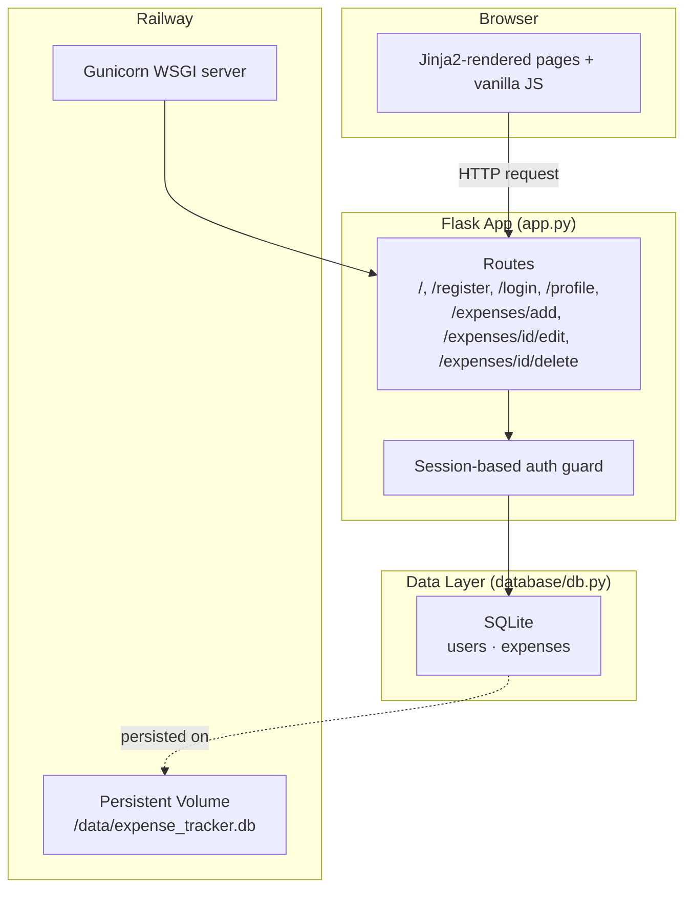
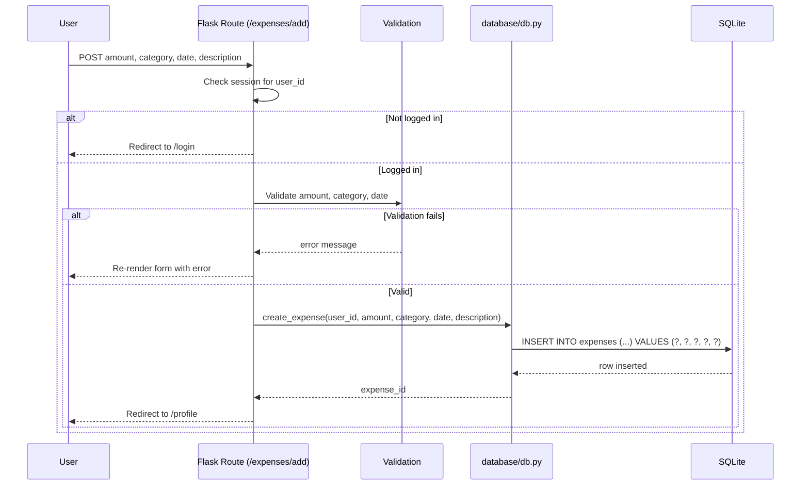
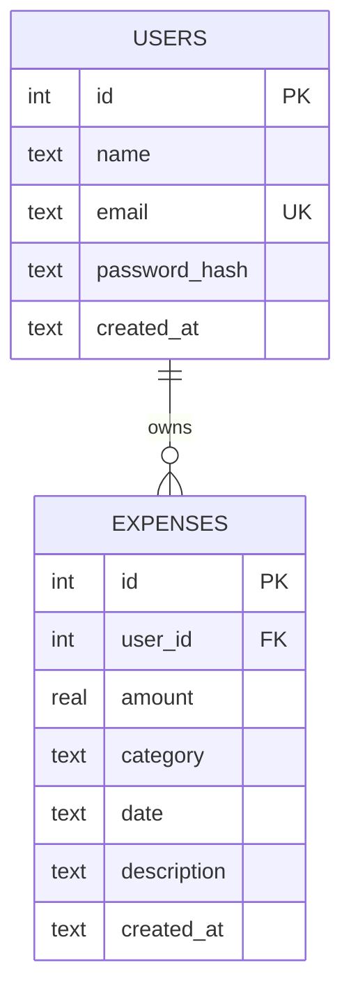

# Spendly

A personal expense tracker built with Flask and SQLite — designed and shipped end-to-end using a spec-driven, AI-assisted engineering workflow with Claude Code.

<p align="center">
  
  
  
  
  
  
  
</p>

---

## Demo

| | |
|---|---|
| 🔗 **Live demo** | [spendly.up.railway.app](https://expense-tracker-production-62d9.up.railway.app) *(demo login: `demo@spendly.com` / `demo123`)* |
| 🖼️ **Screenshots** | `docs/screenshots/` — *add landing, profile, and add-expense screenshots here* |
| 🎥 **Video walkthrough** | *placeholder — add a Loom/YouTube link here* |

---

## Why I Built This

Most "expense tracker" tutorials stop at a CRUD form. I wanted a small, real project to practice something different: running a **full software delivery lifecycle** — spec writing, planning, implementation, testing, code review, and deployment — the way a disciplined engineering team would, but with Claude Code doing the heavy lifting under my direction as the reviewer and decision-maker.

The result is Spendly: a lightweight, single-user-per-account expense tracker where every feature (registration, auth, expense CRUD, date-filtered reporting, category breakdowns) was scoped in a written spec *before* a line of code was written, then implemented incrementally, tested, reviewed, and shipped through its own PR.

---

## Features

**💰 Expense Management**
- Add, edit, and delete expenses with amount, category, date, and description
- Server-side validation on every field (positive amounts, valid categories, valid dates)
- Confirmation dialog before destructive delete actions

**📊 Reporting & Insights**
- Profile dashboard with total spent, transaction count, and top spending category
- Category breakdown with proportional bar visualization
- Date-range filtering across the whole dashboard (transactions, stats, and breakdown all respect the filter)

**🔐 Authentication**
- Email/password registration and login
- Passwords hashed with Werkzeug (`generate_password_hash` / `check_password_hash`)
- Session-based auth with route-level guards on every private page
- Per-user data isolation — every query is scoped to `user_id`

**🎨 Frontend**
- Server-rendered Jinja2 templates, no JS framework
- Vanilla JS progressive enhancement (e.g. animated category bars)
- Responsive, hand-written CSS with a shared design system across pages

**🚀 Infrastructure**
- Deployed on Railway with a persistent volume for the SQLite database
- Production WSGI serving via Gunicorn

---

## Tech Stack

| Layer | Technology |
|---|---|
| **Frontend** | Jinja2 templates, vanilla CSS, vanilla JavaScript (no frameworks, no build step) |
| **Backend** | Flask 3.1 (Python 3.10+), single-file route module (`app.py`) |
| **Database** | SQLite 3, raw `sqlite3` driver, hand-written parameterized SQL (no ORM) |
| **Authentication** | Werkzeug password hashing, Flask session cookies |
| **AI Development** | Claude Code — custom subagents, slash commands, spec-driven workflow |
| **Infrastructure** | Railway (App Platform + persistent volume) |
| **Deployment** | Gunicorn (WSGI), Railway `railway up` / Nixpacks build |
| **Tooling** | pytest, pytest-flask, Git/GitHub, Conventional Commits |

> **Note on scope:** This project intentionally uses SQLite and vanilla JS rather than Postgres/React — the goal was to demonstrate rigorous engineering *process* on a deliberately small, dependency-light stack rather than to showcase framework breadth. See [Key Engineering Decisions](#key-engineering-decisions).

---

## Architecture

### System Architecture



### Request Flow — Adding an Expense



### Database Relationships



---

## AI Development Workflow

> This is the section that matters most. Spendly was not "vibe coded" — it was built using an iterative, reviewable, AI-assisted engineering process where Claude Code acted as an implementation partner operating under explicit specs, constraints, and review gates.

**Spec-driven development.** Every feature started as a written spec (`.claude/specs/NN-feature-name.md`) covering overview, dependencies, routes, database changes, template changes, implementation rules, and a testable "definition of done" — *before* any implementation began.

**Implementation planning.** Specs were reviewed in Claude Code's Plan Mode, which produced a concrete implementation plan (files touched, functions added, edge cases) for approval before any code was written.

**Multi-step execution.** Each feature was implemented incrementally against its spec — database layer first, then routes, then templates — rather than generated in one undifferentiated pass.

**Code generation, grounded in constraints.** All generation was constrained by a project-level `CLAUDE.md`: no ORMs, parameterized SQL only, no inline `<style>` tags, no hardcoded URLs, DB logic confined to `database/db.py`, one responsibility per route.

**Refactoring.** Follow-up passes (e.g. moving the "Add Expense" button into the profile header, linking the navbar name to `/profile`) were scoped as their own small, reviewed changes rather than bundled into feature work.

**Bug fixing.** Issues surfaced during testing or review were root-caused against the spec and source before a fix was applied — not patched blindly.

**Test generation.** Tests were written from the **spec's expected behavior**, not from reading the implementation — this catches cases where the code silently diverges from the intended contract instead of just mirroring whatever the code happens to do.

**Documentation.** Architecture notes and this README were generated and hand-reviewed to stay in sync with what was actually shipped.

**Git workflow & pull requests.** Every feature lived on its own branch, was committed with Conventional Commits, opened as a PR with a spec-derived description and a "how to test" section, and squash-merged — no direct commits to `main`.

---

## Claude Code Workflow

The repository defines its own Claude Code automation under `.claude/` — these are the actual tools used during development, not illustrative examples:

| Command / Agent | Role |
|---|---|
| `/create-spec` | Creates a feature branch and a structured spec file, after checking the working tree is clean and the step isn't already done |
| **Plan Mode** | Turns an approved spec into a concrete, file-by-file implementation plan |
| `/test-feature` | Runs a two-stage pipeline: `spendly-test-writer` writes pytest tests **from the spec**, then `spendly-test-runner` executes only that file and classifies any failure as a bug vs. a missing feature |
| `/code-review-feature` | Runs `spendly-security-reviewer` and `spendly-quality-reviewer` **in parallel** against the diff, then merges both into one report with a prioritized action plan and an explicit verdict (Approved / Changes Requested) |
| `/ship-feature` | Commits with a generated Conventional Commit message, pushes, opens a PR (spec-derived description), squash-merges, deletes the branch, and syncs `main` |

Guardrails encoded directly in `CLAUDE.md` keep every session consistent: a fixed file/folder ownership model (routes only in `app.py`, DB logic only in `database/db.py`), a strict "don't implement a stub route unless the active step targets it" rule, and hard constraints like *always run `PRAGMA foreign_keys = ON`* and *never hardcode a URL in a template*.

The practice these encode — write the spec, plan the change, implement against constraints, generate tests from intent rather than implementation, review for security and quality separately, ship through a PR — is standard senior-engineering discipline. Claude Code is the execution engine; the process is the point.

---

## Folder Structure

```
spendly/
├── app.py                     # All Flask routes — single file, no blueprints
├── database/
│   └── db.py                  # Every SQL query in the app: schema, CRUD, stats
├── templates/
│   ├── base.html               # Shared layout every page extends
│   ├── landing.html            # Marketing landing page
│   ├── register.html / login.html
│   ├── profile.html            # Dashboard: stats, filter, transactions, breakdown
│   ├── add_expense.html / edit_expense.html
│   └── terms.html / privacy.html
├── static/
│   ├── css/                    # style.css (global) + one file per page
│   └── js/main.js              # Vanilla JS progressive enhancement
├── tests/                      # pytest suite, one file per feature
├── .claude/
│   ├── specs/                  # Written spec per feature, source of truth for tests
│   ├── agents/                 # spendly-test-writer/runner, quality/security reviewers
│   └── commands/               # /create-spec, /test-feature, /code-review-feature, /ship-feature
├── Procfile                    # Gunicorn start command for Railway
├── CLAUDE.md                   # Architecture, conventions, and hard constraints
└── requirements.txt
```

---

## Getting Started

### Prerequisites

- Python 3.10+
- `pip`

### Installation

```bash
git clone https://github.com/msdianprince-7/Spendly.git
cd Spendly
python -m venv venv
source venv/bin/activate        # Windows: venv\Scripts\activate
pip install -r requirements.txt
```

### Environment Variables

| Variable | Required | Default | Purpose |
|---|---|---|---|
| `SECRET_KEY` | Recommended in production | `dev-fallback-key` | Flask session signing key |
| `DATABASE_PATH` | No | `./expense_tracker.db` | SQLite file location — set this to a mounted volume path in production |

> **Callout:** The app seeds a demo account on first run (`demo@spendly.com` / `demo123`) so you can explore it immediately without registering.

### Running Locally

```bash
python app.py
# → http://localhost:5001
```

---

## Development Commands

| Command | Description |
|---|---|
| `python app.py` | Run the dev server on port 5001 |
| `pytest` | Run the full test suite |
| `pytest tests/test_foo.py` | Run a single test file |
| `pytest -k "test_name"` | Run a single test by name |
| `pytest -s` | Run tests with stdout visible |
| `gunicorn app:app --bind 0.0.0.0:$PORT` | Run the production WSGI server (used by Railway) |

---

## Key Engineering Decisions

**Flask, single-file routing.** With a route count this small, blueprints add indirection without paying for themselves. All routes live in `app.py`; the moment that stops being true is the moment to split them.

**Raw SQLite over an ORM.** Every query is explicit, parameterized SQL in `database/db.py`. For a schema this size, an ORM buys abstraction the project doesn't need and hides exactly the query behavior worth being able to see at a glance.

**Vanilla JS, no framework.** The frontend has one piece of dynamic behavior (animated bar widths). Reaching for React here would be paying framework tax for a feature that's a few lines of DOM manipulation.

**Session-based auth over JWT.** Server-rendered pages with first-party cookies don't need token-based auth — sessions are simpler, and Flask's signed session cookie is sufficient for this trust boundary.

**SQLite + Railway volume over managed Postgres.** Single-writer, low-concurrency workload; a persistent volume gives durable storage without provisioning a separate database service.

**Gunicorn over the Flask dev server in production.** `app.run(debug=True)` is single-threaded and not hardened for production traffic; Gunicorn is the minimum change needed to make the deploy production-appropriate without adding an unnecessary framework migration.

---

## Performance Optimizations

- **Scoped queries, not full-table scans:** every expense query is filtered by `user_id` (and optionally a date range) at the SQL level via parameterized `WHERE` clauses — no fetch-then-filter in Python.
- **Foreign key enforcement at the connection level:** `PRAGMA foreign_keys = ON` is set on every connection in `get_db()`, catching referential-integrity bugs at the database layer instead of the application layer.
- **Idempotent seeding:** `seed_db()` checks for existing rows before inserting, so app restarts never duplicate demo data.
- **Explicit connection lifecycle:** every DB function opens and closes its own connection in a `try/finally`, avoiding leaked SQLite handles under load.
- **Server-side validation before any write:** invalid amounts, categories, or dates are rejected before touching the database, avoiding wasted writes and rollback logic.

---

## Testing

Spendly's test suite is written **against the spec, not the implementation** — each `tests/test_<feature>.py` file encodes what the feature is supposed to do, so a test failure can mean either "the code has a bug" or "the code doesn't match the intended behavior," and both are useful signals.

Coverage includes:
- Auth guards on every private route (redirect to `/login` when unauthenticated)
- Validation edge cases (non-numeric amounts, invalid categories, malformed dates, zero/negative amounts)
- Per-user data isolation (one user cannot read, edit, or delete another user's expenses)
- Date-range filtering correctness across stats, transactions, and category breakdown
- Database-layer behavior in isolation (`tests/test_db.py`) using a temporary SQLite file per test run

```bash
pytest            # full suite
pytest -v         # verbose, per-test output
```

---

## Future Improvements

- [ ] Recurring expenses and monthly budgets
- [ ] CSV/PDF export of filtered transactions
- [ ] Multi-currency support
- [ ] Email verification on registration
- [ ] Rate limiting on login/register routes
- [ ] Chart.js-based spending trends (replacing the CSS bar breakdown)
- [ ] Automated CI pipeline (GitHub Actions) running `pytest` on every PR
- [ ] Structured logging and error monitoring in production

---

## Lessons Learned

**A spec is a contract, not documentation.** Writing the spec before implementation — and writing tests from that spec rather than from the code — surfaced mismatches between "what I meant" and "what got built" far earlier than a traditional code-first workflow would have.

**Separating security review from quality review sharpens both.** Running them as two focused passes instead of one general "review this" pass produced more specific, actionable findings than a single reviewer trying to hold both lenses at once.

**Constraints make AI-assisted output more predictable, not less.** A short, explicit `CLAUDE.md` (no ORMs, parameterized queries only, one file per responsibility) did more to keep generated code consistent than any amount of prompt engineering per request.

**Small stack, full lifecycle, is a better portfolio piece than a big stack with no process.** It's easy to make a project look impressive by stacking technologies. It's harder — and more representative of real engineering — to show a disciplined spec → plan → build → test → review → ship loop on a deliberately small surface area.

---

## About Me

**Full-stack engineer** with a focus on shipping production-quality software using modern AI-assisted engineering workflows — spec-driven development, Claude Code, and disciplined git practices, alongside hands-on experience across **React, Next.js, TypeScript, Node.js, PostgreSQL, and Docker**.

- 💼 LinkedIn: *[add your LinkedIn URL]*
- 💻 GitHub: *[add your GitHub URL]*
- 🌐 Portfolio: *[add your portfolio URL]*

---

<p align="center"><sub>Built with Flask, SQLite, and a disciplined Claude Code workflow.</sub></p>
